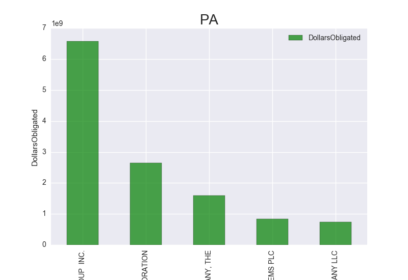
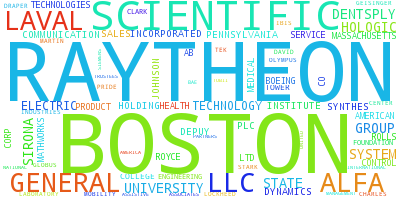
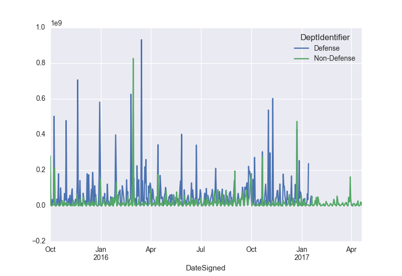

## Final - Analysis of US Government Spending in Fiscal Years 2016 & 2017 for states MA and PA
In this submission, I have done analysis on the data downloded from US government's website __(https://www.usaspending.gov/DownloadCenter/API/Pages/fpds.aspx)__ which tracks the money spent by its internal departments on the contracts given to outside vendors. The download was done with the help of website's API. There are 4 main folders:
### 1. FetchData:
This folder contains 2 iPython notebooks: 
#### i) US Spending - Fetch Data: 
This notebook contains code to make calls to API of US government website. This API provides us with multiple ways of making requests for data based on different parameters and the level of details we want. I have used the link 'https://www.usaspending.gov/fpds/fpds.php?detail=b&fiscal_year=2015&stateCode=TX&max_records=10' which has the following parameters:
- detail=b: 
This signifies that level of detail is 'basic'
- fiscal_year=2015: 
This takes the year for which we want the data. I have taken the data for 2016 & 2017.
- stateCode=TX: 
This takes as input the state code for which we want the data. I have requested the data for states MA and PA.
- max_records=10: 
This is the number of records per file. I set it to 100 per file.
In this notebook there are 2 functions followed by the funtion call. The first function is to find out the total number of records for a particular set of parameters passed in the above link. The second function uses this total number of records to find out the number of files that will be downloaded by dividing it by 100(max_records). Using these functions iteratively I create a directory structure of the form 'year/stateCode/file.xml' to save the files for year 2016 & 2017 for states MA & PA.

#### ii) ConvertXmlToDataFramePickle: 
Once the data was downloaded into a directory structure, I converted the data in XML files into a dataframe and then saved the dataframe as a __'.pickle' file__ which could be easily used for further analysis without going over 1.3GB of data again and again. 

### 2. Data:
This folder contains 2 folders for years 2016 and 2017. Each of these folders further contain 2 folders for states MA and PA which have all the XML files. 

### 3. Extra:
This folder contains the US govt. website's data dictionary in the form of a pdf file (USAspending.govDataDictionary.pdf) which explains terminology used in the XML files in the form of tags. It also contains image of the error encountered while uploading the xml files for PA for year 2016. Total number of files for this folder was 4,984. However, Github limits the number to 1000. 

### 4. Analysis:

#### Please Note (Instructions to run Analysis notebooks):
The pickle file created in 'FetchData' step has not been committed on GitHub due to size restrictions as Github only allows files of size upto 100MB. This size of this file was 405MB. In order to run the analysis again using this pickle file, you need to download it from here (https://drive.google.com/open?id=0B2s5uRu_aLx3SFN1aUVmNXFoZk0) and save it at this path in your system __(Final/Extra/us_spending_df.pickle)__.

Analysis folder consists of 3 analysis done of the pickle file created in the above steps. Also, it consists of addtional folders for each analysis consisting of images of the graphs plotted for each one of them.
#### Analysis 1:
This shows the distribution of US govt. spendings across different:  
#### a) Departments in MA and PA: 
Apart from Dept of Defense(9700) which comes out to be the major expense of the US govt. in both the states, the next most expensive channels turn out to be: 
State - MA 
1.United States Mint(2044): Responsible for circulating coinage for US. 
2.Dept of Veterans Affair(3600): This is a govt-run military veteran benfit system. 
3.NASA(8000) 
4.Federal Aviation Administration(6920) 
5.Agency for International Development(7200): Responsible for administering civilian foreign aid.  

State - PA 
1.Dept of Energy(8900): This dept concerns with the US's policies regarding energy and safety in handling nuclear material. 
2.Dept of Veterans Affair(3600): This is a govt-run military veteran benfit system. 
3.Dept of Education(9100) 
4.Centers for Medicare and Medicaid Services(7530): Federal agency that administers the Medicare program and works in partnership with state governments to administer Medicaid, the State Children's Health Insurance Program (SCHIP), and health insurance portability standards. 
5.Centers for Disease Control and Prevention(7523): Responsible for protecting public health and safety through the control and prevention of disease, injury, and disability in the US and internationally. 

#### b) Vendors in the states MA and PA: 
In MA, Raytheon(for defense) and GE(for energy) turn out to be the major vendors. Next comes the education sector where MIT turns out to be the major vendor in providing ivy league education in MA. 

In PA, Bechtel Group Inc(largest construction and civil engineering company in the United States) emerges as the vendor with maximum contracts. Amerisourcebergen Corp.(world's largest pharmaceutical sourcing and distribution services companies) comes next, followed by Boeing(manufacturing rockets, aircrafts and satellites worldwide).

#### Analysis 2:
This analyses the level of vendor competition in Govt. contracts and highlights the companies which reap the benefits of being in a monopoly situation. Here I have first plotted a chart to show the average amount spent towards such companies who are getting govt. contracts without any competition. This depiction is based on the value of field 'ExtentCompeted' in the data files. The values of this parameter are given below: 
- G = Not Competed under SAP
- F = Competed under SAP
- D = Full and Open Competition after exclusion of sources
- C = Not Competed
- B = Not Available for Competition
- A = Full and Open Competition
- CDO = Competitive Delivery Order 
 
The plot shows that majority of govt. spending goes into such companies. Also, the word cloud shown below highlights the names of these companies. 
 

#### Analysis 3:
This analysis shows the time series analysis of government's spending towards Defense vs Non-Defense sectors. 
A pivot table was created to identify departments as defense and non-defense against each contract sign date. Finally a time series graph was plotted which shows that that govt. spending was always been more towards the 'Defense' sector in 2016 which is good for the country's safety. But they also need to spend towards people's welfare by contributing in non-defense sector. 
 
